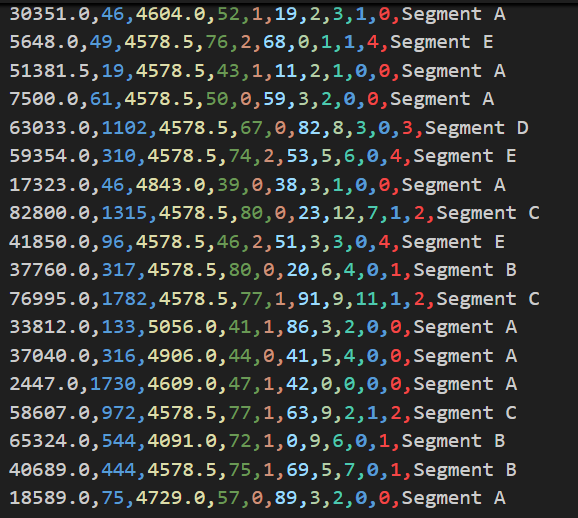
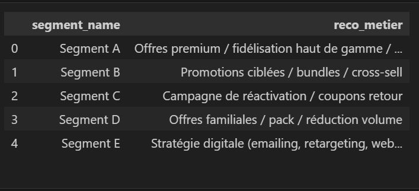
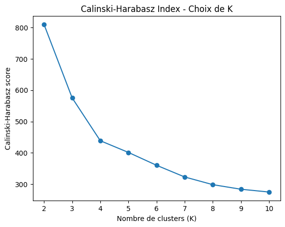
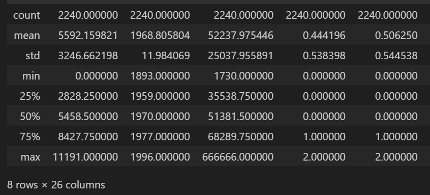
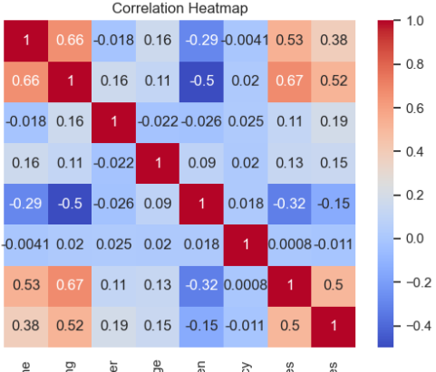
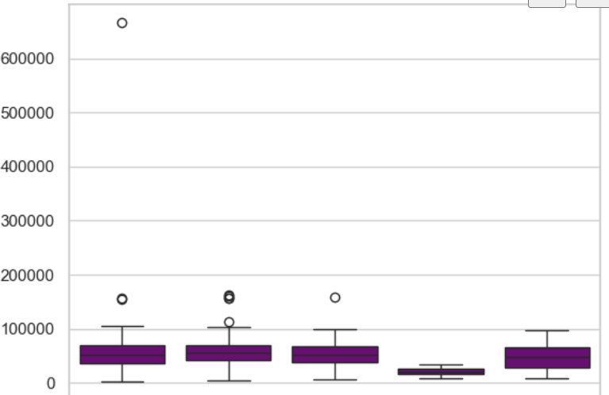
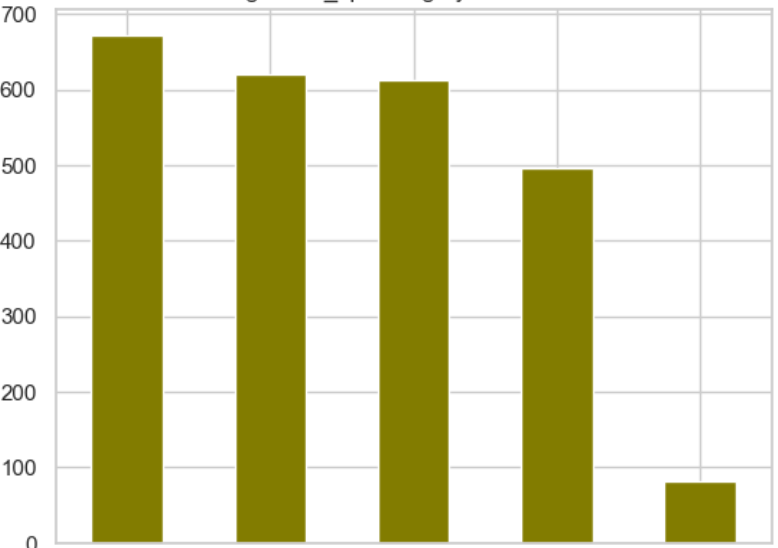

# Bibata SOMBIÉ

**AI Engineer · Data Scientist · Machine Learning & NLP**  
Python · SQL · Power BI
---
👉 **[Cliquez ici pour visualiser l’ensemble de mes projets en détail](https://github.com/SOMBIEB?tab=repositories)**  
ou parcourez ci-dessus un **résumé des projets clés** présentés à travers mon portfolio.

---

## Réalisations & Formations
- Master **Intelligence Artificielle**
- Certificat HarvardX **Data Science Professional**
- Formations Cloud : **AWS**, **Azure**, **OCI**
- 🥇 Mémoire Master (18/20) : *Plateforme collaborative et IA pour enfants TND*

---

#### Langages

#### AI · ML · Data

#### BI · Cloud · DevOps

---

## Compétences clés
- Analyse de données & **EDA**
- **Machine Learning / Deep Learning**
- Feature engineering & **normalisation / scaling**
- Déploiement : **Docker**, API, logique **MLOps**
- Visualisation & reporting orientés **décision métier**
- Domaines : **Santé · Finance · Marketing · Supply Chain**

---

## Portfolio

### Customer Segmentation – Machine Learning (K-Means)

  
  
  
  
  
  

**Analyse et structuration d’une base clients** afin d’identifier des profils comportementaux exploitables par les équipes métiers.

- Nettoyage des données, création de **variables métier** et **standardisation des features**
- Mise en place d’un **clustering non supervisé (K-Means)** avec sélection du nombre optimal de segments
- Identification de **5 segments clients distincts** et **interprétation métier** des profils
- Formulation de **recommandations marketing et commerciales** basées sur les résultats

 **Lien du projet**  
https://github.com/SOMBIEB/customer_segmentation_kmeans_for_business_decision

---

### Consultant Data – Préparation et fiabilisation des données pour le Machine Learning

  
  
  
  
  
  

À partir de données **d’achats clients hétérogènes** et **peu exploitables**, j’ai structuré et fiabilisé des jeux de données à **grande échelle** en réalisant le **nettoyage**, l’**analyse exploratoire (EDA)**, la **sélection de variables orientée métier**, ainsi que la **normalisation et la mise à l’échelle (scaling)** des features, afin de fournir des datasets cohérents et **directement exploitables** par les équipes Data Science et Machine Learning.

---

## Contact
🌐 [LinkedIn](https://www.linkedin.com/in/bibata-sombie)

---

<i>“L’IA n’a de sens que si elle apporte de la valeur concrète.”</i>
